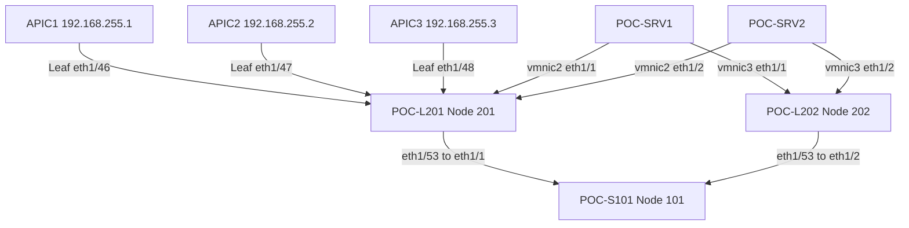
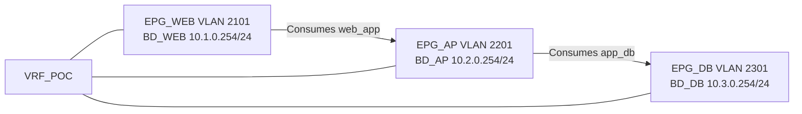

# Cisco ACI LAB Guide

本手冊帶領 ACI 初學者在三台 APIC、一台 Spine、兩台 Leaf 的實體環境中完成一套可重複的 Static Port LAB。每章先以 APIC GUI 手動建立，再用同一套 Python 工具驗證、補齊前置狀態或清理重做。APIC 是唯一狀態來源；工具不依賴本機的完成紀錄。

> **重要警告**：`reset-fabric` 會清除整個 Fabric，無法復原。只有確認六台設備身分、三台 CIMC 可用，並輸入完整確認字串後才可執行。本手冊的 Permit All 與 `0.0.0.0/0` OOB 存取只適用於隔離 LAB。

## 使用方式

在 Windows 10 跳板機開啟 PowerShell：

```powershell
py -3 -m venv .venv
.\.venv\Scripts\Activate.ps1
python -m pip install -r requirements.txt
python aci_lab.py status
```

所有命令執行時都會要求輸入帳號與隱藏密碼。APIC 使用自簽憑證，因此本 LAB 的 `verify_tls` 為 `false`。

## LAB 實體拓撲



## Tenant 邏輯拓撲



# 第 1 章 LAB 架構 接線與前置需求

## 學習目標

辨識所有設備、管理位址、Fabric 介面與 ESXi Static Port 路徑，並準備 Windows Python 環境。

## 概念說明

Fabric 只有 Pod 1。三台 APIC 都接在 Leaf 201；兩台 Leaf 各以 `eth1/53` 上聯同一台 Spine。Static Port 只使用 Leaf 201/202 的 `eth1/1-2`，`eth1/3-4` 保留給未來 VMM LAB。

## 前置檢查

1. 從跳板機確認 APIC `192.168.255.1-3`、CIMC `192.168.255.41-43` 與交換器 OOB 可達。
2. 確認 ESXi 已有 Standard vSwitch，`vmnic2/3` 為雙 Active，負載平衡採 Route based on originating virtual port ID。
3. 確認 VM 與 Port Group 已存在；本手冊不修改 VMware。

## 驗證方式

執行 `python aci_lab.py status`。尚未建立 Fabric 時連線失敗是預期結果。

## 自動化與清理

本章沒有寫入操作。`--dry-run` 可用來檢查命令格式。

## 常見錯誤

- 跳板機未安裝 Python 或未啟用 `.venv`。
- Windows 防火牆、管理交換器或 Gateway 阻擋 SSH/HTTPS。
- 將預留給 VMM 的 `eth1/3-4` 誤納入本 LAB。

# 第 2 章 完整環境重置

## 學習目標

將 APIC 與三台 ACI Switch 回復到可重新初始化與探索的狀態，同時保留 CIMC。

## 概念說明

工具依 Cisco Clean Initialization 流程先清除並重新載入交換器，再對 APIC 執行 `acidiag touch clean`、`acidiag touch setup` 與 reboot。CIMC 不會被重置。

## 操作步驟

先預覽：

```powershell
python aci_lab.py reset-fabric --dry-run
```

正式執行：

```powershell
python aci_lab.py reset-fabric
```

閱讀警告與設備清單後，輸入：

```text
RESET TN_POC FABRIC
```

## 驗證方式

1. 三台 CIMC 仍可登入。
2. APIC 重新開機後進入初始設定狀態。
3. Spine 與 Leaf 開機後不再保留舊 Fabric Policy，可被重新探索。

## 自動化與清理

本章本身就是完整重置。它與一般 `cleanup` 完全不同，不可用於只想重做單一章節的情境。

## 常見錯誤

- 任一 CIMC 或 SSH 目標不可達時，Preflight 會停止。
- 重置後 APIC OOB 尚未完成 Setup Utility，API 暫時無法使用。
- 不可中斷正在寫入 clean marker 或 reload 的設備。

# 第 3 章 APIC Setup Utility 與 Cluster 建立

## 學習目標

透過 CIMC KVM 初始化三台 APIC，建立三節點 Cluster。

## GUI 與主控台步驟

1. 依序登入 CIMC `192.168.255.41-43` 並開啟 KVM。
2. APIC1 選擇建立新 Fabric，Controller ID 設為 1，名稱 `APIC1`。
3. Fabric Name 與 TEP Pool 接受畫面預設值；Infrastructure VLAN 輸入 `3967`。
4. OOB 設為 `192.168.255.1/24`，Gateway `192.168.255.254`。
5. APIC2/3 使用相同 Fabric 參數，ID/名稱分別為 `2/APIC2`、`3/APIC3`，OOB 為 `.2`、`.3`。
6. 等待 Cluster 完成同步。

## 驗證方式

登入任一 APIC GUI，前往 **System > Controllers**，確認三台 Controller 為 Fully Fit。

## 自動化與清理

Setup Utility 必須人工完成。工具從 Cluster 可登入後才接手。

## 常見錯誤

- 三台 APIC 的 Fabric Name、Infra VLAN 或 TEP Pool 不一致。
- Controller ID 重複。
- 管理 IP/Gateway 輸入錯誤。

# 第 4 章 Fabric Switch Discovery Node Registration 與 OOB Management

## 學習目標

探索並以序號註冊 Spine/Leaf，恢復交換器 OOB 管理。

## GUI 手動步驟

1. 前往 **Fabric > Inventory > Fabric Membership**。
2. 依序核對序號並設定：101/POC-S101、201/POC-L201、202/POC-L202，Pod 均為 1。
3. 前往 **Tenants > mgmt > Node Management Addresses**，建立 OOB Node Management Policy。
4. 設定 Spine `.11/24`、Leaf `.21/24`、`.22/24`，Gateway `.254`。
5. 建立允許 `0.0.0.0/0` 的 External Management Network，並關聯 APIC 內建的 `oob-default` OOB Contract。

## 驗證方式

確認 Fabric Membership 三台交換器均 Active，並由跳板機 SSH 至三個 OOB IP。

## 自動化指令

```powershell
python aci_lab.py apply --chapter 4 --dry-run
python aci_lab.py apply --chapter 4
python aci_lab.py verify --chapter 4
```

## 清理與重做

一般 `cleanup` 保留 Node Registration 與 OOB Management；只有 `reset-fabric` 會清除 Fabric Membership。

## 常見錯誤

- 探索序號不符時工具會拒絕註冊。
- `0.0.0.0/0` 只適用隔離 LAB，禁止複製到正式環境。

# 第 5 章 Access Interface Policies

## 學習目標

建立 1G Link Level、CDP 與 LLDP Policy。

## GUI 手動步驟

前往 **Fabric > Access Policies > Policies > Interface**：

| Policy | 名稱 | 設定 |
|---|---|---|
| Link Level | IntPol-1G-Auto | 1G, Auto Negotiation On |
| CDP | IntPol-CDP-Enable | Enabled |
| LLDP | IntPol-LLDP-Enable | Rx/Tx Enabled |

## 驗證與自動化

```powershell
python aci_lab.py apply --chapter 5
python aci_lab.py verify --chapter 5
```

## 清理與重做

`python aci_lab.py cleanup --chapter 5` 會刪除第 5-11 章 LAB 物件。

## 常見錯誤

- 不要建立 10G Policy 或 LACP Policy。
- 名稱大小寫必須完全一致。

# 第 6 章 VLAN Pools Physical Domains 與 AAEP

## 學習目標

建立 Static VLAN Namespace、Physical Domain 與共用 AAEP。

## GUI 手動步驟

前往 **Fabric > Access Policies > Pools > VLAN** 建立：

| Pool | Mode | Block |
|---|---|---|
| VLAN_WEB | Static | 2101-2110 |
| VLAN_AP | Static | 2201-2210 |
| VLAN_DB | Static | 2301-2310 |

前往 **Physical and External Domains** 建立 `DOM_PHY_WEB/AP/DB` 並關聯對應 Pool。建立 `AEP_PHY`，關聯三個 Domain。

## 驗證與自動化

```powershell
python aci_lab.py prepare --chapter 6
python aci_lab.py apply --chapter 6
python aci_lab.py verify --chapter 6
```

## 清理與重做

`cleanup --chapter 6` 會先移除後續關聯，再刪除 Domain、AAEP 與 VLAN Pool。

## 常見錯誤

- VLAN Block 必須是 Static。
- Domain 與錯誤 VLAN Pool 關聯會造成 Encap 無法部署。

# 第 7 章 Leaf Interface Profiles Policy Groups 與 Switch Profiles

## 學習目標

把第 5、6 章政策組合後，只部署到兩台 Leaf 的 `eth1/1-2`。

## GUI 手動步驟

1. 建立 `IfPolGrp-Access-Server_1G`，關聯 `IntPol-1G-Auto`、CDP、LLDP 與 `AEP_PHY`。
2. 建立 `IntProf-LF201/202`。
3. 每個 Profile 建立 `IntSel-eth1_1` 與 `IntSel-eth1_2`，分別選取單一 Port。
4. 建立 `SwProf-LF201/202`，Node Block 分別為 201 與 202。
5. 關聯對應 Interface Profile。

## 驗證與自動化

```powershell
python aci_lab.py prepare --chapter 8
```

若第 1-6 章已完成，第 7 章缺少，工具只建立或修正第 7 章管理欄位。

## 清理與常見錯誤

`cleanup --chapter 7` 會移除第 7-11 章。不要把 Selector 延伸到 `eth1/3-4`。

# 第 8 章 Tenant VRF 與 Bridge Domains

## 學習目標

建立 `TN_POC`、`VRF_POC` 與三個可路由 BD。

## GUI 手動步驟

前往 **Tenants > Add Tenant** 建立 `TN_POC`，再建立 VRF 與 BD：

| BD | Gateway | Scope | Unicast Routing | L2 Unknown | ARP Flood |
|---|---|---|---|---|---|
| BD_WEB | 10.1.0.254/24 | Public | Enabled | Flood | Enabled |
| BD_AP | 10.2.0.254/24 | Public | Enabled | Flood | Enabled |
| BD_DB | 10.3.0.254/24 | Public | Enabled | Flood | Enabled |

## 驗證與自動化

```powershell
python aci_lab.py prepare --chapter 8
python aci_lab.py apply --chapter 8
python aci_lab.py verify --chapter 8
```

## 清理與常見錯誤

`cleanup --chapter 8` 會刪除整個 `TN_POC` 及後續物件。Subnet Scope Public 在本版沒有 L3Out，因此不會實際對外公告。

# 第 9 章 Application Profile 與 EPG

## 學習目標

建立 `AP_POC` 與 WEB/AP/DB 三個 EPG，關聯 BD 與 Physical Domain。

## GUI 手動步驟

前往 **TN_POC > Application Profiles** 建立 `AP_POC`：

| EPG | BD | Physical Domain |
|---|---|---|
| EPG_WEB | BD_WEB | DOM_PHY_WEB |
| EPG_AP | BD_AP | DOM_PHY_AP |
| EPG_DB | BD_DB | DOM_PHY_DB |

## 驗證與自動化

```powershell
python aci_lab.py apply --chapter 9
python aci_lab.py verify --chapter 9
```

## 清理與常見錯誤

此章尚未設定 Static Path。不要把 EPG 關聯到錯誤 BD 或 Domain。

# 第 10 章 Contracts 與 Permit All Filter

## 學習目標

建立兩條具方向性的 Contract 關係並理解 ACI Policy Enforcement。

## GUI 手動步驟

1. 建立 `FLT_WEB_APP_PERMIT_ALL` 與 Entry `PERMIT_ALL`。
2. 建立 Contract `web_app`、Subject `SUBJ_WEB_APP`；WEB 為 Consumer，AP 為 Provider。
3. 建立 `FLT_APP_DB_PERMIT_ALL`。
4. 建立 Contract `app_db`、Subject `SUBJ_APP_DB`；AP 為 Consumer，DB 為 Provider。

## 驗證與自動化

```powershell
python aci_lab.py apply --chapter 10
python aci_lab.py verify --chapter 10
```

## 清理與常見錯誤

本 LAB 使用 Permit All 只為降低初學門檻。正式環境應限制 EtherType、Protocol 與 Port。不要建立 WEB 到 DB 的直接 Contract。

# 第 11 章 Static Port Binding

## 學習目標

把每個 EPG 以 Tagged VLAN 綁定至兩台 Leaf 的四條 ESXi 路徑。

## GUI 手動步驟

在每個 EPG 的 **Static Ports** 建立：

| EPG | Encap | Path | Mode |
|---|---:|---|---|
| EPG_WEB | 2101 | Leaf 201/202 eth1/1-2 | Regular |
| EPG_AP | 2201 | Leaf 201/202 eth1/1-2 | Regular |
| EPG_DB | 2301 | Leaf 201/202 eth1/1-2 | Regular |

每個 EPG 共四條 Path，總計十二條。Regular 表示 Tagged/Trunk，由 ESXi Port Group 加上 VLAN Tag。

## 驗證與自動化

```powershell
python aci_lab.py apply --chapter 11 --dry-run
python aci_lab.py apply --chapter 11
python aci_lab.py verify --chapter 11
```

## 清理與常見錯誤

`cleanup --chapter 11` 只刪除十二條 Binding。不要選用 Native/Untagged，也不要建立 vPC Path。

# 第 12 章 VM Ping 驗證

## 學習目標

人工驗證同 EPG、跨 ESXi 與 Contract 控制的跨 BD 流量。

## VM 位址

| 類型 | VM | IP 範圍 | Gateway | 單數位置 | 雙數位置 |
|---|---|---|---|---|---|
| WEB | POC-WEB1-4 | 10.1.0.1-4/24 | 10.1.0.254 | POC-SRV1 | POC-SRV2 |
| AP | POC-AP1-4 | 10.2.0.1-4/24 | 10.2.0.254 | POC-SRV1 | POC-SRV2 |
| DB | POC-DB1-4 | 10.3.0.1-4/24 | 10.3.0.254 | POC-SRV1 | POC-SRV2 |

## 人工驗證矩陣

| 測試 | 範例 | 預期 |
|---|---|---|
| 同 EPG 跨 ESXi | WEB1 → WEB2 | 成功 |
| WEB Consumer 到 AP Provider | WEB1 → AP2 | 成功 |
| AP Consumer 到 DB Provider | AP1 → DB2 | 成功 |
| 無直接 Contract | WEB1 → DB2 | 失敗 |

工具不登入 ESXi 或 VM，也不記錄 Ping 結果。

## 常見錯誤

- VM OS 防火牆阻擋 ICMP。
- Port Group VLAN 與 EPG Encap 不一致。
- VM Gateway 未設為各 BD 的 `.254`。

# 第 13 章 狀態檢查 章節還原與疑難排解

## 狀態檢查

```powershell
python aci_lab.py status
python aci_lab.py verify --chapter 11
```

## 跳章準備

```powershell
python aci_lab.py prepare --chapter 8
```

工具即時檢查第 4-7 章；正確物件跳過，缺少物件建立，LAB 管理欄位不符時修正，未管理欄位保留。

## 章節還原

```powershell
python aci_lab.py cleanup --chapter 8 --dry-run
python aci_lab.py cleanup --chapter 8
```

指定章節與相依的後續章節會反向刪除。完整 `cleanup` 回到第 5 章開始前，但保留 Cluster、Node Registration 與 OOB Management。

## Cluster 安全

- 三台 Fully Fit：正常執行。
- 非 Fully Fit 但有 Quorum：顯示風險並要求輸入 `YES`。
- 無 Quorum：禁止 Policy 寫入；唯讀命令仍可使用。
- `reset-fabric` 是唯一例外，但仍需完整 Preflight 與確認字串。

## 疑難排解順序

1. 檢查 `logs/` 中最新的 Warning/Error Log。
2. 先確認 APIC Endpoint、Cluster 與 Quorum。
3. 用 `--dry-run` 檢查預計差異。
4. 在 APIC GUI 依物件 DN 核對實際值。
5. 修正連線或設定後重跑；工具會保留已成功物件並接續。

## 附錄 A 常用命令

```powershell
python aci_lab.py status
python aci_lab.py prepare --chapter 8 --dry-run
python aci_lab.py prepare --chapter 8
python aci_lab.py apply --chapter 11
python aci_lab.py verify --chapter 11
python aci_lab.py cleanup --chapter 11
python aci_lab.py cleanup
python aci_lab.py reset-fabric --dry-run
```

## 附錄 B Cisco 清除命令參考

交換器使用 `setup-clean-config.sh` 後 reload。APIC 使用 `acidiag touch clean`、`acidiag touch setup` 後 reboot。這些命令具破壞性，只能由 `reset-fabric` 的受保護流程觸發。
